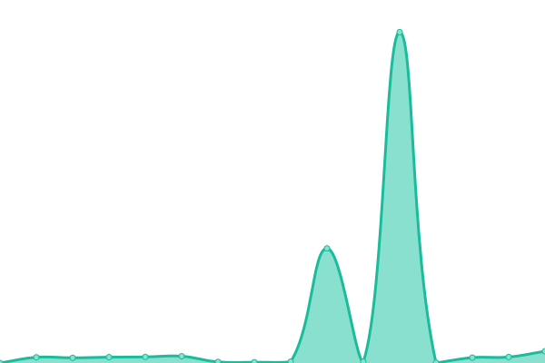
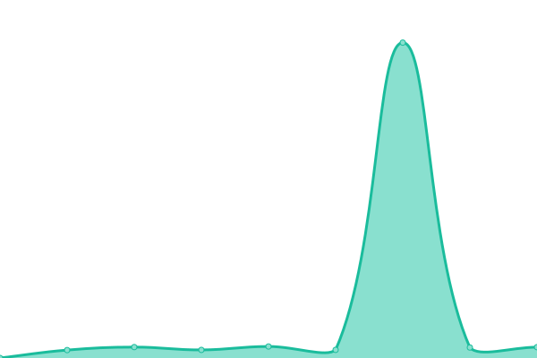

# [📈 Live Status](https://demo.upptime.js.org): <!--live status--> **🟩 All systems operational**

This repository contains the open-source uptime monitor and status page for [puresec-ng](https://demo.upptime.js.org), powered by [Upptime](https://github.com/upptime/upptime).

With [Upptime](https://upptime.js.org), you can get your own unlimited and free uptime monitor and status page, powered entirely by a GitHub repository. We use [Issues](https://github.com/puresec-ng/socialconnector-uptime/issues) as incident reports, [Actions](https://github.com/puresec-ng/socialconnector-uptime/actions) as uptime monitors, and [Pages](https://demo.upptime.js.org) for the status page.

<!--start: status pages-->
<!-- This summary is generated by Upptime (https://github.com/upptime/upptime) -->
<!-- Do not edit this manually, your changes will be overwritten -->
<!-- prettier-ignore -->
| URL | Status | History | Response Time | Uptime |
| --- | ------ | ------- | ------------- | ------ |
|  [Social Connector Backend Core](https://devcore.socialconnector.io/api/health) | 🟩 Up | [social-connector-backend-core.yml](https://github.com/puresec-ng/socialconnector-uptime/commits/HEAD/history/social-connector-backend-core.yml) | 

 887ms
     
 | 

<a href="https://demo.upptime.js.org/history/social-connector-backend-core">100.00%</a>
    

|  [Social Connector Backend Dev](https://devcore.socialconnector.io/api/health) | 🟩 Up | [social-connector-backend-dev.yml](https://github.com/puresec-ng/socialconnector-uptime/commits/HEAD/history/social-connector-backend-dev.yml) | 

 612ms
     
 | 

<a href="https://demo.upptime.js.org/history/social-connector-backend-dev">100.00%</a>
    

|  [Social Connector Frontend Application](https://app.socialconnector.io) | 🟩 Up | [social-connector-frontend-application.yml](https://github.com/puresec-ng/socialconnector-uptime/commits/HEAD/history/social-connector-frontend-application.yml) | 

 782ms
     
 | 

<a href="https://demo.upptime.js.org/history/social-connector-frontend-application">100.00%</a>
    

|  [Social Connector Frontend Application Dev](https://testing.socialconnector.io) | 🟩 Up | [social-connector-frontend-application-dev.yml](https://github.com/puresec-ng/socialconnector-uptime/commits/HEAD/history/social-connector-frontend-application-dev.yml) | 

 654ms
     
 | 

<a href="https://demo.upptime.js.org/history/social-connector-frontend-application-dev">100.00%</a>
    

|  [Social Connector Website](https://socialconnector.io) | 🟩 Up | [social-connector-website.yml](https://github.com/puresec-ng/socialconnector-uptime/commits/HEAD/history/social-connector-website.yml) | 

 651ms
     
 | 

<a href="https://demo.upptime.js.org/history/social-connector-website">100.00%</a>
    

<!--end: status pages-->

[**Visit our status website →**](https://demo.upptime.js.org)

## 📄 License

- Powered by: [Upptime](https://github.com/upptime/upptime)
- Code: [MIT](./LICENSE) © [puresec-ng](https://demo.upptime.js.org)
- Data in the `./history` directory: [Open Database License](https://opendatacommons.org/licenses/odbl/1-0/)
